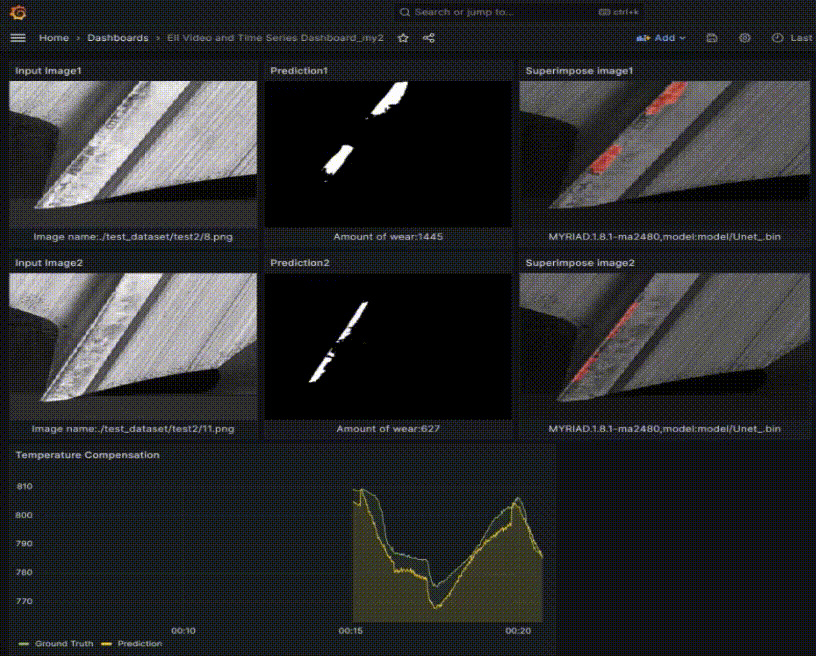

# NCS in EII System Container Setup

## Overview

This guide will walk you through the process of setting up and running the **Intel Edge Insights for Industrial (EII)** system with the **Intel Neural Compute Sticks (NCS)** container.

---

## Setup and Execution

To set up and run the NCS container in the EII system, follow these steps:

1. **Set up the container:**  
   First, navigate to the `build` directory and run the setup scripts:

    ```bash
    cd /home/edge_insights_industrial/Edge_Insights_for_Industrial_4.1.0/IEdgeInsights/build
    sh build_procedure.sh
    sh ../ai_toolwear_ncs/run_container.sh
    ```

   After this, you will be inside the container. The OpenVINO environment should be initialized, and you should see the following:

    ```bash
    [setupvars.sh] OpenVINO environment initialized
    root@ai_toolwear_ncs:/app
    ```

2. **Verify the NCS device name:**  
   To confirm the NCS device name, run the following Python script:

    ```bash
    python3 check_device.py
    ```

3. **Run Inference:**  
   To run the inference, navigate to the `code` directory and execute the script:

    ```bash
    cd code
    sh run.sh
    ```

   If you want to change the device, modify the `-m $device` argument in the `run.sh` script accordingly.

4. **Access the Visualization Dashboard:**  
   To visualize the results, open a web browser and go to your system’s IP address at port `3000`:

    ```bash
    https://$your_IP:3000
    ```

5. **Install the Plugin:**  
   In the dashboard, go to the **Plugins** section and install the **Business Media** plugin.

6. **Import the Dashboard:**  
   Import the provided JSON dashboard:

    ```bash
    ./EII_Video_and_TimeSeries_Dashboard.json
    ```

7. **View the Results:**  
   Once the dashboard is imported, the results will be visualized within it. For example, you will see a result similar to:

   

